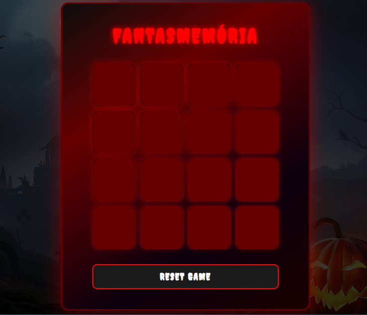

# 👻🎃 Jogo da Memória Fantasmagórico 🕷️🕸️

**Um jogo da memória divertido e interativo**, feito para treinar sua memória e se divertir ao mesmo tempo! Desenvolvido com **HTML, CSS e JavaScript**, com tema de Halloween para dar aquele toque especial.  

---

## ✨ Funcionalidades

- 👻 **Tema "fantasmagórico"** com emojis de Halloween.  
- 🔄 **Feedback visual** ao acertar ou errar pares.  
- 📱 **Design responsivo**, perfeito para desktop e mobile.  
- ✨ **Efeitos visuais animados**, deixando o jogo mais imersivo.  

---

## 🛠 Tecnologias Usadas

- **HTML5** – Estrutura do jogo.  
- **CSS3** – Estilização, animações e responsividade.  
- **JavaScript** – Lógica e interatividade do jogo.  

---

